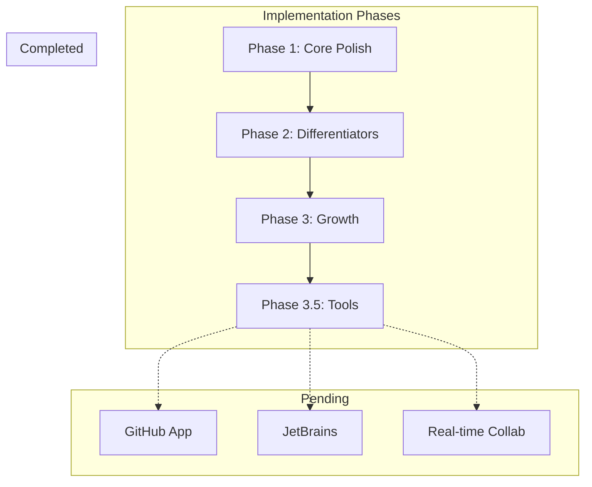

# CodeXplain Implementation Status

**Last updated:** 2026-03-04

## Legend

| Badge | Meaning |
|-------|---------|
| `[x]` | Done |
| `[ ]` | Pending |
| `[~]` | Partial |

## Quick Links

- [Phase 1: Core Polish + Removals + UX Refresh](#phase-1-core-polish--removals--ux-refresh)
- [Phase 2: Differentiators](#phase-2-differentiators)
- [Phase 3: Growth Features](#phase-3-growth-features)
- [Phase 3.5: VS Code Extension & CLI](#phase-35-vs-code-extension--cli)
- [Remaining / Incomplete Items](#remaining--incomplete-items)
- [Features to Add (Near-term)](#features-to-add-near-term)
- [Future Features (Roadmap)](#future-features-roadmap)
- [Important Updates and Fixes](#important-updates-and-fixes)
- [Implementation Checklist](#implementation-checklist)

---

## Architecture Overview



---

## Phase 1: Core Polish + Removals + UX Refresh

**Status: COMPLETE** — All items checked in [plan.md](plan.md)

| Area | Status | Implementation Notes |
|------|--------|----------------------|
| AI Mentor + Bulk Ops removal | [x] | Routes, screens, API, docs removed |
| Language scope | [x] | Python, JS, TS, Go, Rust, Java, C/C++ |
| Health Score | [x] | Single score + 5-dim breakdown, expandable UI |
| Start Here Summary | [x] | Repo-level summary, entry points, contributor quick start |
| Architecture Diagrams | [x] | Selection, trace, "You Are Here", PNG/SVG/Mermaid export |
| Code Review deprioritization | [x] | Tab reorder, top issues by severity |
| UX Refresh | [x] | Design tokens, no purple gradients, Dashboard/RepoDetail/FileDoc |

### Changelog-Derived Additions

From [changelog.md](changelog.md):

- **Billing migrated to Settings** — Credits, prepaid packs, recent activity moved from Dashboard to Settings
- **Gradient removal** — All pages use solid colors (slate, blue); no purple gradients
- **AppLayout with sidebar** — Logo, Compare, Docs, Settings, user menu; Outfit + DM Sans typography
- **BackButton component** — Consistent back navigation with `min-h-[44px]` touch targets
- **Repository polling** — `refetchIntervalInBackground: false`; polls only when tab focused
- **Mark-failed API** — `POST /repositories/:id/mark-failed` for stuck processing repos
- **Delete repo FK cleanup** — Deletes `SavedExploration`, nulls `CreditTransaction`/`BatchJobItem` refs before cascade

---

## Phase 2: Differentiators

**Status: COMPLETE**

| Feature | Status | Location |
|---------|--------|----------|
| Good First Issues | [x] | [backend/app/services/github_service.py](backend/app/services/github_service.py), `GET /repositories/:id/good-first-issues`, [RepositoryDetail.tsx](frontend/src/pages/RepositoryDetail.tsx) |
| Guided onboarding | [x] | [OnboardingTour.tsx](frontend/src/components/OnboardingTour.tsx), `useOnboardingTour` hook |
| Explain This Function/Class | [x] | `POST /chat/explain-function`, [FileDocumentation.tsx](frontend/src/pages/FileDocumentation.tsx), streaming |
| Save & Share Explorations | [x] | `SavedExploration` model, `POST /repositories/:id/explorations`, share_id, public view |

---

## Phase 3: Growth Features

**Status: COMPLETE**

| Feature | Status | Location |
|---------|--------|----------|
| Compare two repos | [x] | [Compare.tsx](frontend/src/pages/Compare.tsx), `POST /repositories/compare`, CLI `compare-repos` |
| Changelog explainer | [x] | `POST /repositories/:id/explain-changelog`, RepositoryDetail modal, CLI `changelog` |
| Before You PR checklist | [x] | `POST /repositories/:id/pr-checklist`, RepositoryDetail, CLI `pr-checklist` |
| VS Code extension | [x] | [codexplain-vscode/](codexplain-vscode/) |
| CLI tool | [x] | [codexplain-cli/](codexplain-cli/) |

---

## Phase 3.5: VS Code Extension & CLI

### VS Code Extension — All items complete

| Capability | Status |
|------------|--------|
| Analyze Current File | [x] |
| Explain Selection (streaming) | [x] |
| Hover hints (quick function summaries) | [x] |
| CodeLens (complexity indicators) | [x] |
| Quick Fix diagnostics (health score issues) | [x] |
| Results panel | [x] |
| Copy to clipboard (Markdown) | [x] |
| Open in CodeXplain | [x] |
| Config: API URL, token, status bar, webAppUrl | [x] |

### CLI — All items complete

| Command | Status |
|---------|--------|
| `analyze <repo-url>` | [x] |
| `file <path>` | [x] |
| `list` | [x] |
| `status <repoId>` | [x] |
| `open <repoId>` | [x] |
| `compare <file1> <file2>` | [x] |
| `changelog <repoId>` | [x] |
| `pr-checklist <repoId>` | [x] |
| `compare-repos <repoId1> <repoId2>` | [x] |
| Config: `set-key`, `set-url`, `show` | [x] |
| Output: Markdown, JSON, `--out` for reports | [x] |

---

## Remaining / Incomplete Items

### Documentation vs Implementation Gaps

| Item | Status | Notes |
|------|--------|-------|
| GitHub Integration | [x] | Added signed webhook endpoint, PR analysis persistence with fetched changed-file diffs, and real PR comment publish path (`dry_run=false`) |
| Rate limiting | [x] | Added SlowAPI middleware and route limits (auth/upload/analysis/webhook); docs now include config-driven policy note |
| Quality Metrics | [x] | Added quality snapshot history, repository aggregate endpoint, user quality profile weights, and analytics integration |

### Minor Polish

| Item | Status | Notes |
|------|--------|-------|
| Onboarding tour targets | [ ] | Verify all `data-tour` targets exist (e.g. `upload-button`, `repositories-list`, `chat-button`) |
| Docs tools "Coming Soon" | [ ] | Update [docs/docs/tools/index.md](docs/docs/tools/index.md) to reflect current vs planned features |

---

## Features to Add (Near-term)

From [README.md](README.md) roadmap and docs:

| Feature | Status | Notes |
|---------|--------|-------|
| Real-time Collaboration | [x] | Collaboration sessions + notes + presence websocket implemented (MVP) |
| VS Code Repository Overview | [x] | Added `CodeXplain: Analyze Repository` command and backend `POST /code-analysis/repository-overview` |
| API Webhooks | [x] | Webhook endpoint CRUD, signed deliveries, retry/dead-letter states, and delivery processing endpoint |
| Custom Templates | [x] | Added Settings template manager for create/list/delete and improved template workflow UX |
| Advanced Analytics | [x] | Added analytics overview, quality trends, and repository benchmarks APIs + Settings panel |

---

## Future Features (Roadmap)

From [README.md](README.md) and [docs/docs/tools/index.md](docs/docs/tools/index.md):

| Feature | Status | Notes |
|---------|--------|-------|
| JetBrains Plugin | [ ] | IntelliJ, PyCharm, WebStorm support |
| GitHub App | [ ] | Automatic PR analysis and comments |
| Multi-language Translation | [ ] | Documentation in multiple languages |
| Enterprise: SSO, RBAC, audit logs | [ ] | |
| AI Code Generation | [ ] | Generate code from documentation |
| Advanced Testing | [ ] | Automated test case generation |
| Performance Monitoring | [ ] | Real-time performance insights |
| Vector DB / Semantic code search | [ ] | From [codeexplain-guide.md](codeexplain-guide.md) |

---

## Important Updates and Fixes

### Deployment

| Resource | Description |
|----------|-------------|
| [PUBLIC_DEPLOYMENT_GUIDE.md](PUBLIC_DEPLOYMENT_GUIDE.md) | VPS, Railway, Nginx, SSL, backups |
| [RAILWAY_TROUBLESHOOTING.md](RAILWAY_TROUBLESHOOTING.md) | Dockerfile path, root directory |
| [env.template](env.template) | Stripe, CORS, rate limits |

### Security / Ops

| Fix | Description |
|-----|-------------|
| Delete repo | FK cleanup (SavedExploration, CreditTransaction, BatchJobItem) before cascade |
| Mark failed | `POST /repositories/:id/mark-failed` for stuck processing |
| Polling | `refetchIntervalInBackground: false` to reduce backend load when tab unfocused |

### URL / Branding

| Resource | URL |
|----------|-----|
| Live site | https://code-xplain.up.railway.app |
| Docs site | https://code-explain-production.up.railway.app |
| GitHub | nanaagyei/code-explain vs codeexplain/codeexplain-cli (verify consistency) |

---

## Implementation Checklist

When implementing a feature:

```
[ ] Update plan.md checklist
[ ] Append changelog.md entry with date
[ ] Update IMPLEMENTATION_STATUS.md
[ ] Add/update tests
[ ] Update relevant docs if API/UI changed
```

### Update Protocol (from plan.md)

Every PR or batch of changes must:

1. Update the relevant checklist items in [plan.md](plan.md)
2. Append a dated entry to [changelog.md](changelog.md)
3. Capture any decision or risk changes in [plan.md](plan.md)

---

## Related Documents

| Document | Purpose |
|----------|---------|
| [plan.md](plan.md) | Source of truth for scope, decisions, risks |
| [changelog.md](changelog.md) | Checkpoint log for frontend redesign and fixes |
| [codeexplain-guide.md](codeexplain-guide.md) | Production-ready implementation guide |
| [README.md](README.md) | Project overview, quick start, roadmap |
| [docs/docs/](docs/docs/) | Feature docs, API reference, development guides |
