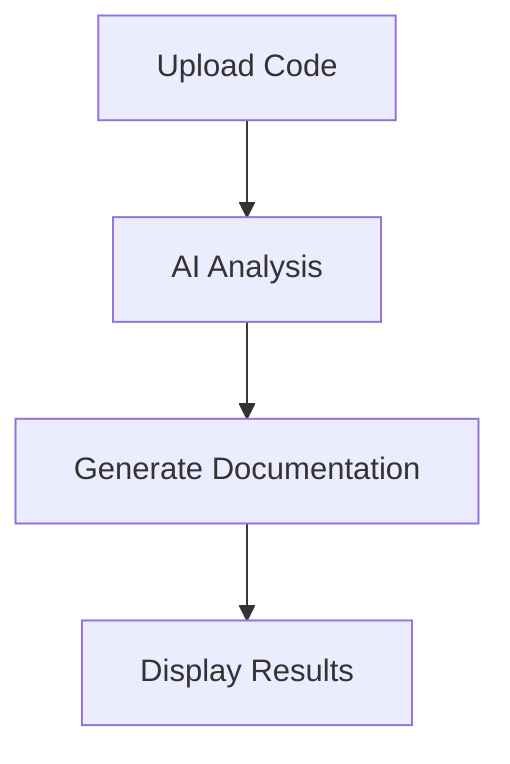

# CodeExplain Documentation

This directory contains the comprehensive documentation for CodeExplain, built with Docusaurus.

## 🚀 Quick Start

### Prerequisites

- Node.js 18+ 
- npm or yarn

### Installation

```bash
# Install dependencies
npm install

# Start development server
npm start

# Build for production
npm run build

# Serve production build
npm run serve
```

## 📁 Documentation Structure

```
docs/
├── docs/                          # Documentation content
│   ├── getting-started/           # Getting started guides
│   ├── features/                 # Feature documentation
│   ├── api/                      # API reference
│   ├── development/              # Development guides
│   └── troubleshooting/          # Troubleshooting guides
├── src/                          # Source files
│   ├── components/               # React components
│   ├── pages/                    # Custom pages
│   └── css/                      # Custom styles
├── static/                       # Static assets
└── docusaurus.config.ts         # Docusaurus configuration
```

## 🎨 Customization

### Brand Colors

The documentation uses CodeExplain's brand colors:

- **Primary**: `#6366f1` (Indigo)
- **Secondary**: `#8b5cf6` (Purple)  
- **Accent**: `#06b6d4` (Cyan)
- **Success**: `#10b981` (Emerald)
- **Warning**: `#f59e0b` (Amber)
- **Error**: `#ef4444` (Red)

### Adding New Content

1. **New Documentation Page**:
   ```bash
   # Create new markdown file
   touch docs/features/new-feature.md
   
   # Add to sidebar in sidebars.ts
   ```

2. **New Component**:
   ```bash
   # Create React component
   touch src/components/NewComponent.tsx
   ```

3. **New Page**:
   ```bash
   # Create custom page
   touch src/pages/custom-page.tsx
   ```

## 📝 Writing Guidelines

### Markdown Best Practices

- Use clear, descriptive headings
- Include code examples with syntax highlighting
- Add diagrams using Mermaid syntax
- Use consistent formatting
- Include practical examples

### Code Examples

```typescript
// Use TypeScript for code examples
interface CodeReview {
  security_issues: SecurityIssue[];
  performance_issues: PerformanceIssue[];
  overall_score: number;
}
```

### Diagrams



## 🔧 Configuration

### Docusaurus Config

Key configuration options in `docusaurus.config.ts`:

- **Site URL**: Update for production deployment
- **Base URL**: Set for GitHub Pages or custom domain
- **Theme**: Customize colors and styling
- **Plugins**: Add search, analytics, etc.

### Sidebar Configuration

Edit `sidebars.ts` to organize documentation:

```typescript
const sidebars: SidebarsConfig = {
  tutorialSidebar: [
    {
      type: 'category',
      label: 'Getting Started',
      items: ['getting-started/introduction'],
    },
  ],
};
```

## 🚀 Deployment

### GitHub Pages

```bash
# Build documentation
npm run build

# Deploy to GitHub Pages
npm run deploy
```

### Custom Domain

1. Add `CNAME` file to `static/` directory
2. Configure DNS settings
3. Update `docusaurus.config.ts` with domain

## 📊 Analytics

### Google Analytics

Add to `docusaurus.config.ts`:

```typescript
themeConfig: {
  googleAnalytics: {
    trackingID: 'GA_TRACKING_ID',
  },
}
```

### Search

Configure Algolia search:

```typescript
themeConfig: {
  algolia: {
    appId: 'YOUR_APP_ID',
    apiKey: 'YOUR_SEARCH_API_KEY',
    indexName: 'codeexplain',
  },
}
```

## 🤝 Contributing

### Adding Documentation

1. Fork the repository
2. Create feature branch
3. Add/update documentation
4. Test locally with `npm start`
5. Submit pull request

### Review Process

- All documentation changes require review
- Ensure examples are tested and working
- Follow the established style guide
- Update sidebar if adding new sections

## 📚 Resources

- [Docusaurus Documentation](https://docusaurus.io/docs)
- [Markdown Guide](https://www.markdownguide.org/)
- [Mermaid Diagrams](https://mermaid-js.github.io/mermaid/)
- [CodeExplain GitHub](https://github.com/codeexplain/codeexplain)

## 🐛 Troubleshooting

### Common Issues

1. **Build Errors**: Check for syntax errors in markdown
2. **Missing Images**: Ensure images are in `static/img/`
3. **Sidebar Issues**: Verify file paths in `sidebars.ts`
4. **Styling Problems**: Check CSS module imports

### Getting Help

- Check Docusaurus documentation
- Search existing issues
- Create new issue with details
- Join Discord community

---

**Happy documenting!** 📝✨
