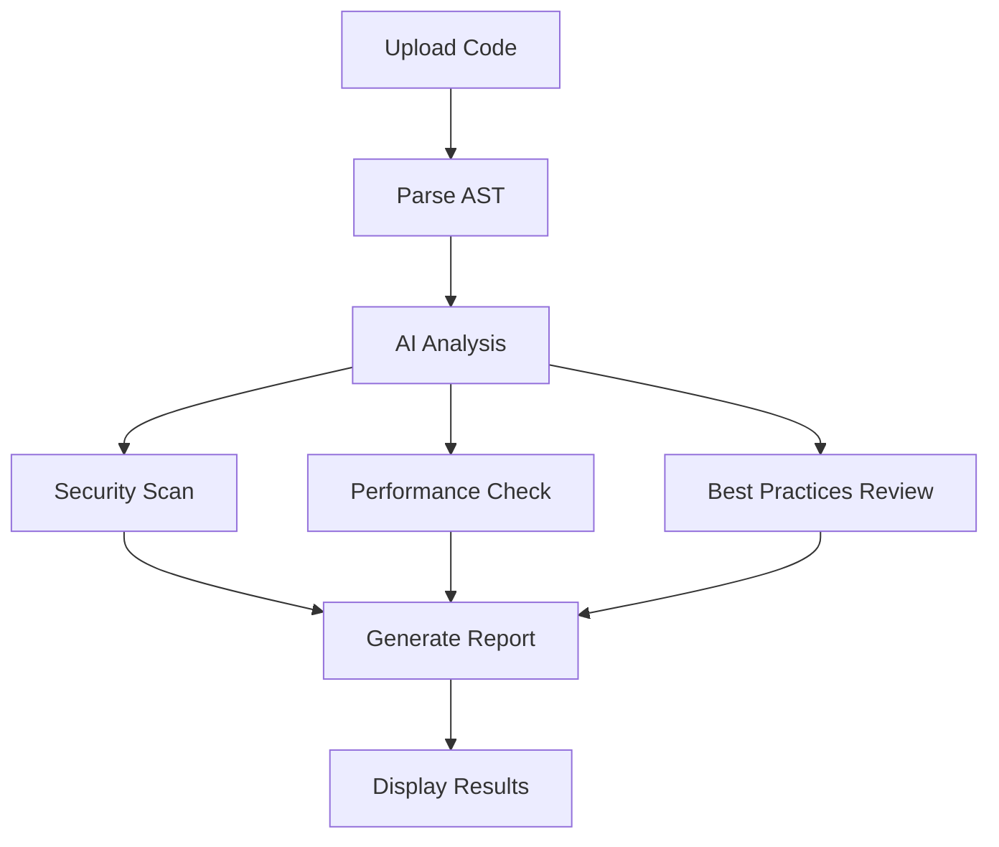

# AI Code Review

CodeExplain's AI Code Review feature provides comprehensive analysis of your code, identifying security vulnerabilities, performance issues, and suggesting best practices improvements.

## Overview

The AI Code Review feature uses advanced machine learning models to analyze your code and provide:

- 🔒 **Security Analysis** - Detect vulnerabilities and security risks
- ⚡ **Performance Optimization** - Identify bottlenecks and inefficiencies  
- 📋 **Best Practices** - Suggest code improvements and standards
- 📊 **Overall Scoring** - Quantified assessment of code quality

## How It Works

### 1. Code Analysis Process



### 2. Analysis Categories

#### Security Issues
- **OWASP Top 10** vulnerabilities
- **Input validation** problems
- **Authentication** and authorization flaws
- **Data exposure** risks
- **Injection attacks** (SQL, XSS, etc.)

#### Performance Issues
- **Algorithm complexity** analysis
- **Memory leaks** detection
- **Resource usage** optimization
- **Database query** efficiency
- **Caching** opportunities

#### Best Practices
- **Code structure** improvements
- **Naming conventions** suggestions
- **Documentation** recommendations
- **Error handling** patterns
- **Testing** strategies

## Using AI Code Review

### 1. Generate Review

1. Navigate to any file in your repository
2. Click the **"Code Review"** tab
3. Click **"Generate Review"** button
4. Wait for analysis to complete (usually 5-15 seconds)

### 2. Review Results

The review results are displayed in organized sections:

#### Security Issues Panel
```markdown
🔴 Critical Issues (2)
- SQL Injection vulnerability in line 45
- Hardcoded API key in line 12

🟡 Medium Issues (3)  
- Missing input validation in line 78
- Weak password hashing in line 156
- CORS misconfiguration in line 203
```

#### Performance Issues Panel
```markdown
⚡ High Impact (1)
- O(n²) algorithm in line 89 - consider optimization

🟡 Medium Impact (2)
- Unnecessary database queries in loop
- Large object creation in tight loop
```

#### Best Practices Panel
```markdown
✅ Good Practices
- Consistent naming conventions
- Good error handling structure

🔧 Improvements Needed
- Add type hints for better readability
- Consider using dependency injection
- Add comprehensive unit tests
```

### 3. Understanding Scores

#### Overall Score
- **90-100**: Excellent code quality
- **70-89**: Good with minor improvements needed
- **50-69**: Fair with several areas for improvement
- **0-49**: Needs significant refactoring

#### Severity Levels
- **🔴 Critical**: Immediate security or stability risk
- **🟡 High**: Important issues that should be addressed
- **🟠 Medium**: Improvements that enhance code quality
- **🟢 Low**: Minor suggestions for optimization

## Advanced Features

### 1. Custom Review Criteria

Configure review parameters in Settings:

```json
{
  "security": {
    "owasp_enabled": true,
    "custom_rules": ["no_hardcoded_secrets", "input_validation"]
  },
  "performance": {
    "complexity_threshold": 10,
    "memory_analysis": true
  },
  "best_practices": {
    "language_specific": true,
    "framework_guidelines": "django"
  }
}
```

### 2. Batch Review

Process multiple files simultaneously:

1. Select multiple files in repository
2. Click **"Batch Review"**
3. Choose review types:
   - Security Analysis
   - Performance Check
   - Best Practices Review
4. Click **"Start Batch Review"**

### 3. Historical Tracking

Track code quality improvements over time:

- **Trend Analysis**: See how scores change over commits
- **Progress Reports**: Weekly/monthly quality summaries
- **Team Metrics**: Compare quality across team members

## Integration Examples

### Python Code Review

**Input Code:**
```python
def authenticate_user(username, password):
    query = f"SELECT * FROM users WHERE username='{username}' AND password='{password}'"
    result = database.execute(query)
    return result.fetchone() is not None
```

**AI Review Results:**

#### Security Issues
```markdown
🔴 CRITICAL: SQL Injection Vulnerability
- Line 2: Direct string interpolation in SQL query
- Risk: Complete database compromise possible
- Fix: Use parameterized queries
```

#### Performance Issues
```markdown
🟡 MEDIUM: Inefficient Password Handling
- Line 2: Storing plaintext passwords
- Risk: Data breach exposure
- Fix: Use bcrypt or similar hashing
```

#### Best Practices
```markdown
🔧 IMPROVEMENT: Add Input Validation
- Add username/password length validation
- Implement rate limiting for login attempts
- Add proper error handling
```

### JavaScript Code Review

**Input Code:**
```javascript
function processUserData(userData) {
    const processedData = {};
    for (let i = 0; i < userData.length; i++) {
        processedData[userData[i].id] = userData[i];
    }
    return processedData;
}
```

**AI Review Results:**

#### Performance Issues
```markdown
⚡ HIGH: Inefficient Object Construction
- Line 3-5: O(n) loop with object property assignment
- Suggestion: Use Object.fromEntries() or Map
```

#### Best Practices
```markdown
🔧 IMPROVEMENT: Add Type Safety
- Add TypeScript interfaces
- Implement input validation
- Add error handling for malformed data
```

## API Integration

### Generate Code Review

```typescript
// Frontend API call
const review = await api.generateCodeReview(repoId, fileId);

// Response structure
interface CodeReview {
  security_issues: SecurityIssue[];
  performance_issues: PerformanceIssue[];
  best_practices: BestPractice[];
  overall_score: number;
  summary: string;
  processing_time: number;
  cached: boolean;
}
```

### Security Issue Structure

```typescript
interface SecurityIssue {
  severity: 'critical' | 'high' | 'medium' | 'low';
  type: string;
  line_number: number;
  description: string;
  fix_suggestion: string;
  cwe_id?: string;  // Common Weakness Enumeration ID
  owasp_category?: string;
}
```

### Performance Issue Structure

```typescript
interface PerformanceIssue {
  impact: 'high' | 'medium' | 'low';
  type: string;
  line_number: number;
  description: string;
  optimization_suggestion: string;
  complexity_analysis?: {
    time_complexity: string;
    space_complexity: string;
  };
}
```

## Best Practices for Code Review

### 1. Regular Reviews
- Run reviews on every major commit
- Set up automated reviews in CI/CD pipeline
- Review new code before merging

### 2. Team Standards
- Establish severity thresholds for your team
- Create custom rules for your codebase
- Document review criteria and processes

### 3. Action Items
- Prioritize critical security issues
- Address performance bottlenecks
- Implement best practices gradually

### 4. Learning from Reviews
- Use suggestions to improve coding skills
- Share knowledge with team members
- Track improvement over time

## Troubleshooting

### Common Issues

#### Review Not Generating
- Check OpenAI API key configuration
- Verify file is supported language
- Check file size limits (max 10MB)

#### Inaccurate Results
- Ensure code is syntactically correct
- Provide context through comments
- Use descriptive variable names

#### Performance Issues
- Large files may take longer to process
- Use batch processing for multiple files
- Consider caching for repeated reviews

## Tips for Better Reviews

### 1. Code Quality
- Write clean, readable code
- Use meaningful variable names
- Add comments for complex logic
- Follow consistent style guidelines

### 2. Context Matters
- Include relevant imports and dependencies
- Provide context through file structure
- Use descriptive function and class names

### 3. Regular Updates
- Re-run reviews after code changes
- Monitor trends over time
- Address issues promptly

---

The AI Code Review feature helps you maintain high code quality, identify security risks early, and continuously improve your development practices. Use it regularly to build better, more secure, and more maintainable code! 🚀
