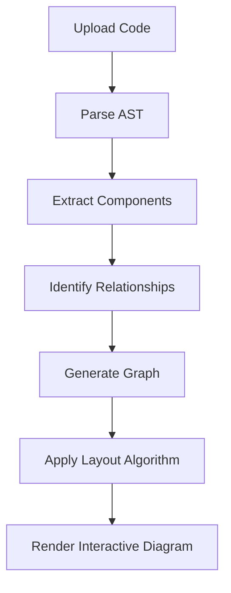

# Architecture Diagrams

CodeExplain's Architecture Diagrams feature creates interactive, visual representations of your code structure, helping you understand complex relationships and dependencies at a glance.

## Overview

The Architecture Diagrams feature provides:

- 🏗️ **Interactive Visualizations** - Zoom, pan, and explore your code structure
- 🔗 **Relationship Mapping** - See how components connect and depend on each other
- 📊 **Multiple Layouts** - Horizontal, vertical, and circular arrangements
- 🎨 **Custom Node Types** - Different visual styles for functions, classes, modules, and APIs
- 📤 **Export Options** - Save diagrams as PNG, SVG, or interactive formats

## How It Works

### 1. Code Analysis Process



### 2. Component Detection

The system automatically identifies:

- **Functions** - Individual function definitions and calls
- **Classes** - Class definitions, inheritance, and composition
- **Modules** - File imports and exports
- **APIs** - HTTP endpoints and service interfaces
- **Data Flow** - How data moves through your system

## Using Architecture Diagrams

### 1. Generate Diagram

1. Navigate to any file in your repository
2. Click the **"Architecture"** tab
3. Click **"Generate Diagram"** button
4. Wait for analysis to complete (usually 5-15 seconds)

### 2. Explore the Diagram

The interactive diagram displays your code structure with:

#### Node Types
- 🔵 **Functions** - Individual functions and methods
- 🟣 **Classes** - Class definitions and objects
- 🟢 **Modules** - File imports and exports
- 🟠 **APIs** - HTTP endpoints and services

#### Edge Types
- **Solid Lines** - Direct function calls
- **Dashed Lines** - Import/export relationships
- **Dotted Lines** - Dependency connections

### 3. Interactive Features

#### Navigation
- **Zoom**: Mouse wheel or zoom controls
- **Pan**: Click and drag to move around
- **Fit**: Auto-fit diagram to viewport
- **Reset**: Return to original view

#### Node Interaction
- **Click**: Select and highlight nodes
- **Hover**: Show detailed information
- **Double-click**: Expand/collapse node details

## Diagram Layouts

### 1. Vertical Layout (Default)
```
Module A
    ↓
Function 1 → Function 2
    ↓
Class A
    ↓
API Endpoint
```

### 2. Horizontal Layout
```
Module A → Function 1 → Function 2 → Class A → API Endpoint
```

### 3. Circular Layout
```
    Module A
        ↓
Function 1 ← → Function 2
        ↓
    Class A
```

## Advanced Features

### 1. Custom Layouts

Configure diagram appearance:

```typescript
interface DiagramConfig {
  layout: 'vertical' | 'horizontal' | 'circular';
  nodeSpacing: number;
  levelSeparation: number;
  direction: 'TB' | 'BT' | 'LR' | 'RL';
  nodeSize: {
    width: number;
    height: number;
  };
  edgeStyle: {
    type: 'solid' | 'dashed' | 'dotted';
    width: number;
    color: string;
  };
}
```

### 2. Filtering and Focus

- **Filter by Type**: Show only functions, classes, or modules
- **Focus Mode**: Highlight specific components
- **Dependency View**: Show only direct dependencies
- **Call Chain**: Trace execution paths

### 3. Export Options

Save diagrams in multiple formats:

- **PNG**: High-resolution images for documentation
- **SVG**: Scalable vector graphics for web
- **JSON**: Raw graph data for further processing
- **Interactive HTML**: Standalone interactive diagrams

## Example Diagrams

### Python Flask Application

**Input Code:**
```python
from flask import Flask, request, jsonify
from database import Database
from auth import authenticate_user

app = Flask(__name__)
db = Database()

@app.route('/api/users', methods=['GET'])
def get_users():
    user = authenticate_user(request.headers.get('Authorization'))
    if not user:
        return jsonify({'error': 'Unauthorized'}), 401
    
    users = db.get_all_users()
    return jsonify(users)

@app.route('/api/users/<int:user_id>', methods=['GET'])
def get_user(user_id):
    user = authenticate_user(request.headers.get('Authorization'))
    if not user:
        return jsonify({'error': 'Unauthorized'}), 401
    
    user_data = db.get_user_by_id(user_id)
    return jsonify(user_data)
```

**Generated Diagram:**
```
┌─────────────────┐
│   Flask App     │
└─────────────────┘
         │
         ▼
┌─────────────────┐
│  /api/users     │
└─────────────────┘
         │
         ▼
┌─────────────────┐
│ authenticate_user│
└─────────────────┘
         │
         ▼
┌─────────────────┐
│   Database      │
└─────────────────┘
```

### React Component Structure

**Input Code:**
```jsx
import React, { useState, useEffect } from 'react';
import { fetchUserData } from './api';
import UserCard from './UserCard';

function UserDashboard() {
  const [users, setUsers] = useState([]);
  
  useEffect(() => {
    fetchUserData().then(setUsers);
  }, []);
  
  return (
    <div>
      {users.map(user => (
        <UserCard key={user.id} user={user} />
      ))}
    </div>
  );
}
```

**Generated Diagram:**
```
┌─────────────────┐
│ UserDashboard  │
└─────────────────┘
         │
         ▼
┌─────────────────┐
│  fetchUserData  │
└─────────────────┘
         │
         ▼
┌─────────────────┐
│   UserCard      │
└─────────────────┘
```

## API Integration

### Generate Architecture Diagram

```typescript
// Frontend API call
const diagram = await api.generateArchitectureDiagram(repoId, fileId);

// Response structure
interface ArchitectureDiagram {
  nodes: ArchitectureNode[];
  edges: ArchitectureEdge[];
  layout: string;
  metadata: {
    total_nodes: number;
    total_edges: number;
    complexity_score: number;
  };
  processing_time: number;
  cached: boolean;
}
```

### Node Structure

```typescript
interface ArchitectureNode {
  id: string;
  type: 'function' | 'class' | 'module' | 'api';
  label: string;
  description: string;
  metadata: {
    line_number: number;
    complexity: number;
    dependencies: string[];
    parameters?: string[];
    return_type?: string;
  };
  position: {
    x: number;
    y: number;
  };
}
```

### Edge Structure

```typescript
interface ArchitectureEdge {
  id: string;
  source: string;
  target: string;
  label: string;
  type: 'calls' | 'imports' | 'depends_on' | 'inherits';
  metadata: {
    frequency?: number;
    parameters?: string[];
    return_value?: string;
  };
}
```

## Best Practices

### 1. Code Organization

**For Better Diagrams:**
- Use clear module boundaries
- Follow consistent naming conventions
- Separate concerns appropriately
- Use meaningful function and class names

### 2. Relationship Clarity

**Improve Connections:**
- Minimize circular dependencies
- Use dependency injection
- Create clear interfaces
- Document relationships

### 3. Diagram Usage

**Effective Visualization:**
- Use diagrams for complex systems
- Focus on key relationships
- Update diagrams when code changes
- Share diagrams with team members

## Troubleshooting

### Common Issues

#### Diagram Not Generating
- Check file language support
- Verify code syntax is correct
- Ensure file size is within limits
- Check for complex circular dependencies

#### Poor Layout
- Try different layout algorithms
- Adjust node spacing settings
- Use filtering to focus on key components
- Consider breaking down large files

#### Performance Issues
- Large codebases may take longer
- Use filtering to reduce complexity
- Consider processing in chunks
- Use caching for repeated analysis

### Tips for Better Diagrams

#### 1. Code Structure
- Keep functions focused and small
- Use clear module boundaries
- Minimize deep nesting
- Follow consistent patterns

#### 2. Naming Conventions
- Use descriptive names
- Follow language conventions
- Be consistent across modules
- Avoid abbreviations

#### 3. Documentation
- Add comments for complex logic
- Document interfaces and APIs
- Explain business logic
- Use type hints where possible

## Integration Examples

### CI/CD Pipeline

```yaml
# Generate architecture diagrams in CI
- name: Generate Architecture Diagrams
  run: |
    codeexplain generate-diagrams --repo $REPO_ID --output ./docs/diagrams
```

### Documentation Generation

```bash
# Generate diagrams for documentation
codeexplain export-diagrams --format svg --output ./docs/architecture/
```

### Team Collaboration

```markdown
## Architecture Overview


### Key Components
- **API Layer**: Handles HTTP requests
- **Business Logic**: Core application logic
- **Data Layer**: Database interactions
- **External Services**: Third-party integrations
```

---

The Architecture Diagrams feature helps you visualize and understand complex code structures, making it easier to maintain, refactor, and onboard new team members. Use it regularly to keep your mental model of the codebase up to date! 🚀
